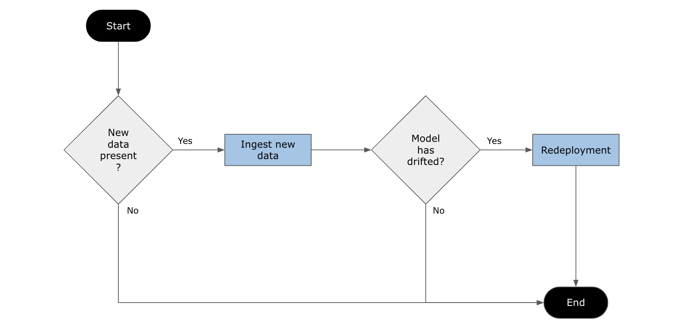

# ML Monitoring for an Attrition Risk Assessment System
A simple framework for machine learning models post deployment, which in this project, is applied to an attrition risk assessment system.

## Project Structure
This repository follows the following structure:

    .
    ├── sourcedata/                       # Directory storing data for model development
    ├── practicedata/                     # Directory storing data for practice
    ├── testdata/                         # Directory storing data for testing
    ├── ingesteddata/                     # Directory storing clean data
    ├── practicemodels/                   # Directory storing trial models
    ├── models/                           # Directory storing models build with sourcedata
    ├── productiondeployment/             # Directory soring deployed model
    ├── images/                           # Directory soring images  
    ├── ingestion.py   
    ├── training.py                     
    ├── scoring.py         
    ├── deployment.py
    ├── reporting.py    
    ├── diagnostics.py   
    ├── app.py    
    ├── apicalls.py  
    ├── fullprocess.py
    ├── wsgi.py                             
    ├── config.json
    ├── slice_output.txt
    ├── cronjob.txt
    └── README.md

## Running the Project
To install the requirements, run the following command:

    pip install -r requirements.txt

To run the app locally, run the following command:

    python app.py

To run the API calls, open a new CL/terminal tab, then run the following command:

    python apicalls.py

To run other scripts individually, run the following command:

    python {SCRIPT_NAME}.py

## Process Diagram
The monitoring process follows the diagram below:

### Data Ingestion

### Model Retraining & Redeployment